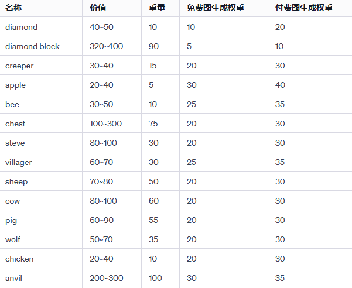

# LethalCompany_MinecraftScraps

添加我的世界废品！每种物品都有独特的音效！

从致命公司里回收来自我的世界的废品吧

废品的详细信息请参考

后续会更新更多我的世界废品！

如果你也想加入更新团队，可以去我的github上一起制作！

采用了LethalExpansion作为前置模组

模型来源：https://sketchfab.com/3d-models/

参考教程：https://github.com/HolographicWings/LethalSDK-Unity-Project/

# 1.4.0

现在工具废品（diamond sword，diamond pickaxe）真的可以被当做武器挥动了！（尽管在别人视角看起来会比较奇怪，但是在自己看来问题不大）

添加了工具挥动音效

钻石剑的伤害是原版铲子的两倍

钻石镐的伤害是原版铲子的一倍

修复了双持物品时的手部动画，调整了一些废品遮挡视野的问题（ghast）

后续会继续更新带有特殊效果的物品（例如可以发光的火把，发光的鱿鱼，制造噪声的各种物品，甚至是弓！？）

除此之外非常感谢HolographicWings的LethalSDK-Unity-Project支持！

# 1.3.0

增加新的工具废品（diamond sword，diamond pickaxe）

增加生物废品（zombie，ghast，spider）

增加方块废品（tnt，pumkin）

南瓜头现在会阻挡你的视野，这很好的还原了我的世界原版XD

虽然工具废品仅仅只是废品，无法作为工具使用或者攻击，但是会在后续的版本 进行更新

修改了部分废品的手持效果，放置在蹲下来放置时卡进地面

将cow改成单手持有

或许anvil和creeper会导电？

考虑到LethalExpansion作为前置模组默认会将废品价值减少，现在普遍提高了MinecraftScraps的价值

# 1.2.1

微调说明文档

# 1.2.0

更新更多生物废品（sheep，cow，pig，wolf，chicken），以及一个非常沉重的anvil！

等待LethalExpansion开发出武器功能时会进一步更新钻石剑，钻石镐等废品！

# 1.1.0

更新更多我的世界废品（apple，bee，chest，steve，villager）！并调整了一些物品的数值以及生成权重

# 1.0.1

微调说明文档

# 1.0.0

正式添加废品

